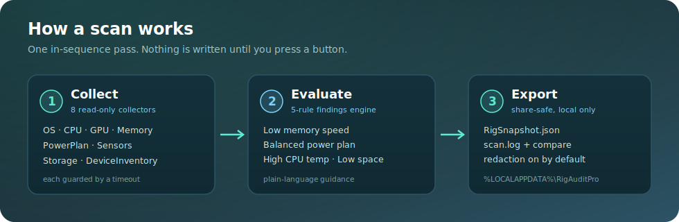
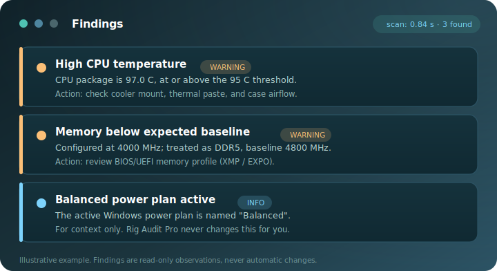

<div align="center">


<br/>

[](LICENSE)
[](https://dotnet.microsoft.com/)


### See everything. Change nothing.

**Rig Audit Pro** is a read-only Windows desktop app that audits your gaming PC's key performance configuration, surfaces a calm and professional set of findings, and writes everything to local files you control.

It is an **auditor, not an optimizer.** It never tweaks, installs, injects, runs a service, or phones home.

</div>

---

## Why Rig Audit Pro

Most "PC optimizer" tools want to *change* your system — flip registry keys, install drivers, run background services, and ship your specs off to a server. Rig Audit Pro does the opposite. It reads your configuration, tells you in plain language what might be holding your rig back, and stops there. Every artifact stays on your disk, and the only outbound action that ever happens is a driver-page link you click yourself.

If a tool can't break your machine, you can run it without a second thought. That's the entire design goal.

## Features

| | Feature | What it gives you |
| :--: | --- | --- |
| 🔍 | **Eight read-only collectors** | OS, CPU, GPU, memory, power plan, sensors, storage, and device inventory — gathered in a single pass. |
| 🧭 | **Five-rule findings engine** | Real configuration issues flagged with plain-language, non-alarmist guidance. |
| 🪞 | **Snapshot compare** | Pick two saved snapshots and see exactly *what changed* between them. |
| 🛡️ | **Share-safe export** | Optional personal-identifier redaction, **on by default** — paste your specs to a forum without leaking your username. |
| 🔗 | **Official driver shortcut** | One click opens the correct NVIDIA / AMD / Intel driver page in *your* browser. No bundled drivers, no auto-download. |
| ⏱️ | **Timing transparency** | Per-collector and total scan timing, shown in the UI and written to `scan.log`. |
| 🧯 | **Fault isolated** | Each collector runs under a timeout — one stall or failure never crashes the scan. |
| 📁 | **Local-only output** | Everything lands in a timestamped folder under `%LOCALAPPDATA%\RigAuditPro\Outputs\`. |

## How It Works

A scan runs every collector **in sequence** (each guarded by a timeout), assembles a `RigSnapshot`, evaluates the rules engine against it, and renders the results. Nothing is written until you trigger a scan or export, and every artifact lands in a timestamped local folder.

<div align="center">



</div>

### What the findings panel looks like

Findings are calm, specific, and actionable — each one explains *what* was observed and *what you could do about it*. They are observations, never automatic changes.

<div align="center">



</div>

### The eight collectors

| Collector | What it reads | Source |
| --- | --- | --- |
| `OsCollector` | Windows edition, version, build | WMI |
| `CpuCollector` | CPU name, physical / logical cores | WMI `Win32_Processor` |
| `GpuCollector` | GPU name, vendor, driver version | WMI `Win32_VideoController` |
| `MemoryCollector` | Total physical memory, configured clock | WMI |
| `PowerPlanCollector` | Active power plan name + GUID | `powercfg /getactivescheme` (read-only) |
| `SensorCollector` | CPU / GPU temps and load (best effort) | LibreHardwareMonitor |
| `StorageCollector` | Fixed drives, free-space %, SMART (best effort) | WMI |
| `DeviceInventoryCollector` | Network / audio / HID / controller inventory | SetupAPI / WMI |

### The five findings rules

| Rule | Severity | Triggers when |
| --- | --- | --- |
| Low memory speed | ⚠️ Warning | Configured clock is below the DDR4/DDR5 baseline heuristic (e.g. XMP/EXPO may be off) |
| High CPU temp | ⚠️ Warning | CPU package temperature is **≥ 95 °C** |
| Low free space | ⚠️ Warning | Any fixed drive is **below 15 %** free |
| Balanced power plan | ℹ️ Info | The active power plan name contains `"Balanced"` |
| Missing data | ℹ️ Info | A required field could not be detected |

> The memory heuristic treats a configured clock of **≥ 4000 MHz** as DDR5 (baseline 4800 MHz) and anything lower as DDR4 (baseline 2666 MHz).

### Output

Each scan writes a timestamped folder under `%LOCALAPPDATA%\RigAuditPro\Outputs\<timestamp>\`:

```text
%LOCALAPPDATA%\RigAuditPro\Outputs\<timestamp>\
  RigSnapshot.json          # the scan snapshot
  scan.log                  # sanitized per-collector timing + results
  RigSnapshot.export.json   # manual export (optional identifier redaction)
  SnapshotCompare.txt       # manual snapshot-compare export
  debug.log                 # debug mode only, full exception detail
```

Output paths are confined to the `Outputs` root, and reparse points (junctions / symlinks) are rejected — exports cannot escape the sandboxed folder.

## Safety

Safety isn't a footnote here — it's the whole point of the product. By design, Rig Audit Pro:

- **Is read-only** — no registry writes, no BIOS actions, no settings tweaks, no driver installs. It observes; it never modifies.
- **Makes no scanning network calls** — no telemetry, no analytics, no "latest driver" web checks. The only outbound action is the optional driver-page button, which opens an official vendor URL in *your* default browser when *you* click it.
- **Never touches games** — no overlays, no injection, no background service, no scheduled scans. The app does nothing unless it is open and you press a button.
- **Fails gracefully** — missing sensors or WMI fields are reported as `Unknown` instead of crashing, and slow collectors time out instead of hanging.
- **Keeps your data local** — all artifacts stay under `%LOCALAPPDATA%\RigAuditPro\Outputs\`, and share-safe export redacts personal identifiers (computer name, Windows user) **by default**.

## Quick Start

```bash
dotnet run --project src/RigAudit.App
```

Click **Run Scan**, review the results, then optionally **Export JSON** or **Open output folder**. A typical scan finishes in seconds and writes nothing outside `%LOCALAPPDATA%\RigAuditPro\Outputs\`.

## Build

```bash
dotnet build RigAuditPro.sln
```

**Tech stack:** C# · .NET 8 · WPF · System.Management (WMI) · LibreHardwareMonitorLib · System.Text.Json.

> Rig Audit Pro targets Windows; the WMI / SetupAPI / sensor collectors require a Windows host to run a real scan.

## Project Layout

```text
RigAuditPro.sln
src/
  RigAudit.App/          WPF UI (scan, export, compare)
  RigAudit.Core/         Models, findings, rules, and snapshot-compare logic
  RigAudit.Collectors/   WMI/LHM/SetupAPI collectors + scan runner + logging
  RigAudit.Export/       Output-folder helper + JSON / log writers
docs/                    Security & QA audit summary
```

## Roadmap

- **V1** — core collectors, findings engine, share-safe export, official driver-page shortcut, scan-timing transparency. ✅
- **V2** — storage audit, device inventory, low-free-space rule, and the snapshot-compare workflow. ✅

## License

<div align="center">

Apache-2.0 — see [LICENSE](LICENSE). © 2026 gshepptech

</div>
